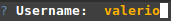
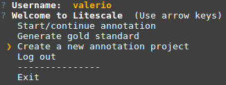
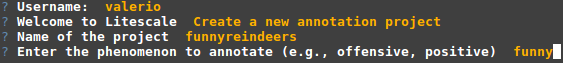
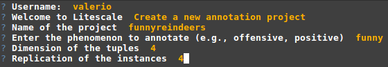
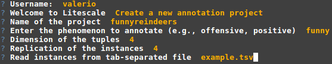
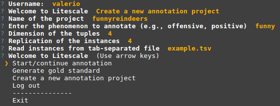
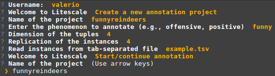
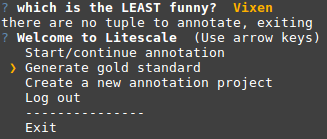

Example of workflow
-------------------

* Start Litescale command-line:

    ./litescale-cli.py

* Insert a username

* Select *Create a new annotation project*

* Give a name to the project

* Indicate the phenomenon to annotate

* Select the dimension and replication of the tuples

* Select a TSV file to read the instances from

* Start the annotation

* Select the project

* **Annotate**!

* When done, generate the gold standard file

The TSV gold file will be in projects/*funnyreindeers*/gold.tsv
